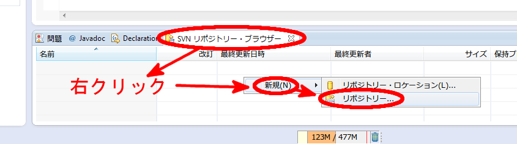
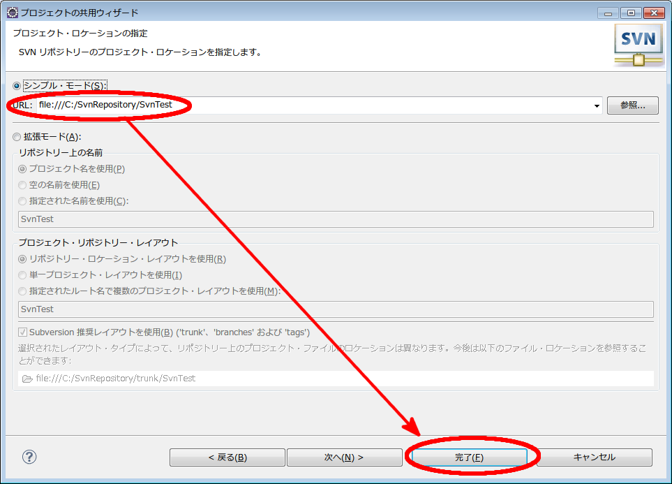
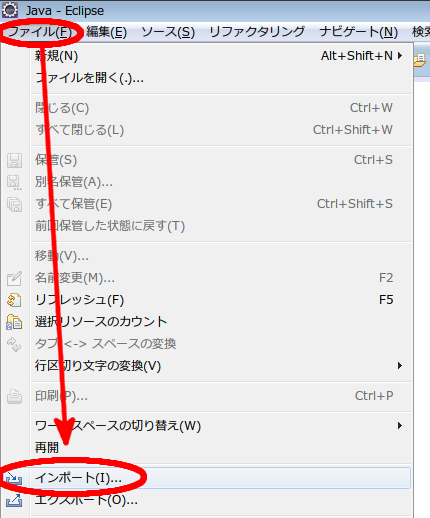

# EclipseでSVNを使って共同開発する際の準備

#### 目次
1. [前提条件](#m001)
1. [SVNリポジトリーを作成する](#m002)
1. [既存プロジェクトをSVNで管理する](#m003)
1. [リポジトリーからプロジェクトを作成する](#m004)
1. [補足: ホスティングサービスを使う場合](#m005)
1. [補足: リポジトリーをLAN内で共有する場合](#m006)
1. [補足: VisualSVNを使う場合](#m007)

- - - - - - - - - - - - - - -
## [前提条件](#m001i)
#### 環境
- Windows7
- Eclipse 4.3 Kepler

#### 状況
以下のように共同開発の準備を整える場合の作業手順を説明しています。

1. 代表者がEclipseで新規プロジェクトを作成する。
1. 代表者がプロジェクトをリポジトリーに登録する。
1. チーム各員がリポジトリーからプロジェクトを作成する。

※ 準備が整った後の更新作業については触れません。

- - - - - - - - - - - - - - -
## [SVNリポジトリーを作成する](#m002i)
Eclipseを使ってリポジトリーを作成します。  
以下の例では、代表者のPCの中に作成しています。

#### "SVNリポジトリー・ブラウザー"のビューを開く
`ウィンドウ -> ビューの表示 -> その他`の順に選択します。

ツリーの中から`SVNリポジトリー・ブラウザー`を選択します。  
Eclipseの画面の下方に、新しくビューが表示されます。

#### リポジトリーを作成する
先ほど作成した"SVNリポジトリー・ブラウザー"の中で、  
`(右クリック) -> 新規 -> リポジトリー`の順に選択します。

任意の場所にフォルダを作成し、その中にリポジトリを置くこととします。  
ここでは、Cドライブ直下に"SvnRepository"というフォルダを作成します。  
`参照`ボタンからツリーをたどって作成しても構いませんし、テキストボックスの中にパスを直接入力しても構いません。  
(C:\SvnRepository)

#### リポジトリーを確認する
エクスプローラーでフォルダが作成されたことを確認することもできます。  
ここでは、Eclipseで確認する方法を紹介します。

`ウィンドウ -> パースペクティブを開く -> その他`の順に選択します。

`SVNリポジトリー・エクスプローラー`を選択します。

画面左にエクスプローラーが表示され、リポジトリーを確認することができます。  
また、削除などの各種操作も行えます。

元の画面に戻るには、画面右上でパースペクティブを切り替えます。

- - - - - - - - - - - - - - -
## [既存プロジェクトをSVNで管理する](#m003i)
すでに代表者が下記のようなプロジェクトを作成しているという前提で進めます。

#### プロジェクトをSVNリポジトリーに新しく追加
`プロジェクト名を右クリック -> チーム -> プロジェクトの共用`の順に選択します。

リポジトリー・プラグインにSVNを選択します。

"新しいリポジトリー・ロケーションを作成"を選択します。

※ 既存のリポジトリーを使用する場合は、この画面は現れません。  
リポジトリー・ロケーションの情報を入力します。  
リポジトリーが他のマシンに存在する場合は、認証情報も必要になります。

`シンプル・モード`が選択され、リポジトリーの直下にプロジェクト名が追加された形でロケーションとなっていることを確認して`完了`を選択します。

#### 最初のコミット
続いて、最初のコミットを行います。  
コメントを入力して`OK`を選択します。  
コメントの内容は任意ですが、チームの規則などに従ってください。

- - - - - - - - - - - - - - -
## [リポジトリーからプロジェクトを作成する](#m004i)
チーム各員がリポジトリーをチェックアウトしてそれぞれのPCに取り込み、それを元にプロジェクトを作成します。

`ファイル -> インポート`の順に選択します。

`SVNからプロジェクト`を選択します。

**プロジェクト名も含んだ**ロケーションを指定します。  
(例: file:///C:/SvnRepository/SvnTest )  
必要ならば認証情報も入力します。

ここでも、ロケーションに**プロジェクト名が含まれている**ことを確認します。  
なお、`改訂`は一番上の`HEAD 改訂`(最新版)で構いません。  

作成されるプロジェクト名を確認した上で`完了`を選択します。

チェックアウトが完了しました。

- - - - - - - - - - - - - - -
## [補足: ホスティングサービスを使う場合](#m005i)
リポジトリーをWeb上のホスティングサービスで保管する場合、若干操作が異なります。  
今回は無料で非公開のリポジトリーを作成できる [Assembla](https://www.assembla.com/home) というサービスを使います。  
( Assembla https://www.assembla.com/home )

#### 前提
すでにAssemblaにユーザ登録しているものとします。

#### リモートにリポジトリーを作成する
同一のマシンの中にリポジトリーを作成する場合、フォルダとリポジトリーを同時に作成していました。  
(比較: [SVNリポジトリーを作成する/リポジトリーを作成する](#link001) )

今回は`リポジトリー・ロケーション`を選択します。

URLと認証情報を入力し、`完了`を選択すればリポジトリーが作成されます。  
`SVNリポジトリー・エクスプローラー`パースペクティブで確認して下さい。

#### リモートリポジトリーからプロジェクトを作成する
チェックアウトするリモートリポジトリーのURLを指定する際に注意することがあります。  
(比較:  [リポジトリーからプロジェクトを作成する](#m004) )

デフォルトでは目標のプロジェクトが選択されていないため、一階層上の構造を取得してしまいます。  
そこで、`参照`ボタンをクリックして目標のプロジェクトを選択します。

この他の操作は同一マシンにリポジトリーを作成する場合と変わりありません。

- - - - - - - - - - - - - - -
## [補足: リポジトリーをLAN内で共有する場合](#m006i)
手軽に共同開発の環境が整います。

#### リポジトリーを置くフォルダを共有する
Windowsでフォルダを共有する操作はここでは割愛します。

#### リポジトリー・ロケーションの記述
- 形式: `file://(コンピュータ名)/(リポジトリー名)`
- 例: `file://sutara-pc/SvnRepository`

リポジトリーからチェックアウトしてプロジェクトを作成する場合の注意点はAssemblaを利用する場合と同じです。  
階層を下って目標のプロジェクトを選択しなければなりません。

- - - - - - - - - - - - - - -
## [補足: VisualSVNを使う場合](#m007i)
共有フォルダではなく [VisualSVN](http://www.visualsvn.com/) を利用します。  
Windowsによる共有がうまく行かない場合におすすめです。  
(VisualSVN http://www.visualsvn.com/ )

#### VisualSVN-Serverのインストール
下記からダウンロードします。  
http://www.visualsvn.com/server/download/

インストールで注意することは下記の2点です。

- "Standard Edition"を選択する。  
  
- `Use secure connection`のチェックを外し、ポート番号を`8181`とする。  
  (他と重複しない、任意の番号にします。)
  

#### リポジトリーを作成
`Repositories`を右クリックして`Create New Repository`を選択します。

ウィザードに従って進めれば問題ありません。  
リポジトリー作成が完了した際に表示されるURLをメモしておいてください。

- 形式: `http://(コンピュータ名):(ポート番号)/svn/(リポジトリー名)`
- 例: `http://sutara-pc:8181/svn/TestSVN/`

#### ユーザを作成
`Users`を右クリックして`Create User`を選択します。

ここでは、『ユーザ名: user1, パスワード: user1』として登録します。

#### Eclipseにリポジトリーを登録する
VisualSVN-Serverで作成したリポジトリーのURLやユーザ情報は、Eclipseでは下記のように利用します。

